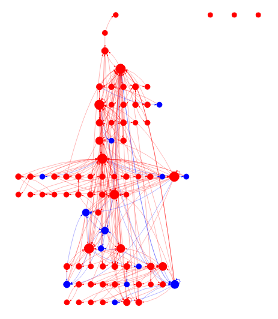

# hasura-permission-checker

This is a simple tool **under development** for debugging and testing the permissions in Hasura.
Right now it can create an interactive graph (example below) highlighting in red the root nodes (tables that the frontend
can query directly). Nodes have label (table name) and role (private/public) attributes that you can filter by.

The graph is a visual aid to understand the permissions and the relationships between tables, but we can use the underlying
structure to programmatically test which paths are possible but shouldn't be.

I intent to implement more features like:
- Highlight graph diff between PRs, so we have a visual representation of what changed.
- Test paths between tables, to check if a user can access a table through another table.
- Highlight unprotected paths (tables that can be accessed without any restrictions).
- Better filtering options and node/edge tooltips with more information.
 

## Development

Run `pip install -e .` to install the project dependencies.